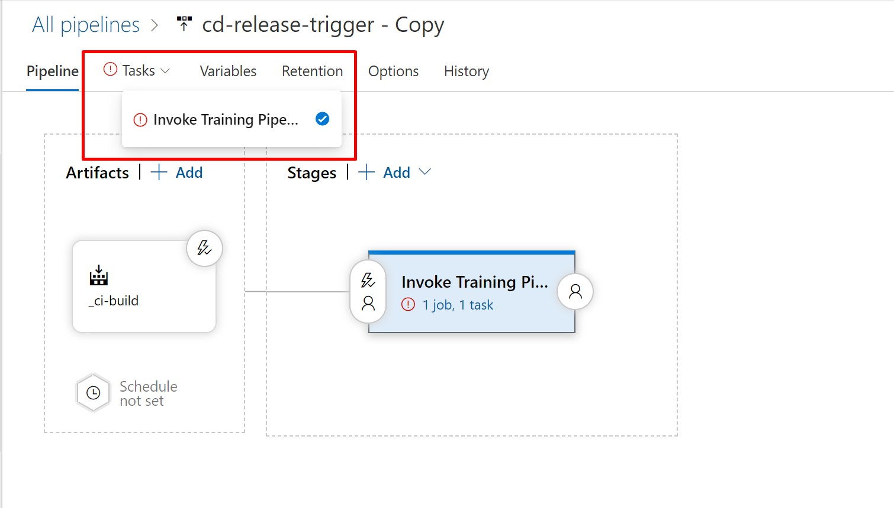

# Getting Started with this Repo

For a complete example setup in Azure DevOps, please see [https://dev.azure.com/kafong/azure-mlops-python](https://dev.azure.com/kafong/azure-mlops-python)

## Clone or fork this repository

## Create an Azure DevOps account

We use Azure DevOps for running our build (CI), retraining trigger and release
(CD) pipelines. If you don't already have an Azure DevOps account, create one by
following the instructions [here](https://docs.microsoft.com/en-us/azure/devops/organizations/accounts/create-organization?view=azure-devops).

If you already have Azure DevOps account, create a [new project](https://docs.microsoft.com/en-us/azure/devops/organizations/projects/create-project?view=azure-devops).

## Create a Service Principal to login to Azure

To create service principal, register an application entity in Azure Active
Directory (Azure AD) and grant it the Contributor or Owner role of the
subscription or the resource group where the web service belongs to. See
[how to create service principal](https://docs.microsoft.com/en-us/azure/active-directory/develop/howto-create-service-principal-portal) and assign permissions to manage Azure
resource.

Please make note of the following values after creating a service principal, we
will need them in subsequent steps:

* Application (client) ID
* Directory (tenant) ID
* Application Secret

**Note:** You must have sufficient permissions to register an application with
your Azure AD tenant, and assign the application to a role in your Azure
subscription. Contact your subscription administrator if you don't have the
permissions. Normally a subscription admin can create a Service principal and
can provide you the details.

## Create a Variable Group for your Pipelines

We make use of variable group inside Azure DevOps to store variables and their
values that we want to make available across multiple pipelines. You can either
store the values directly in [Azure DevOps](https://docs.microsoft.com/en-us/azure/devops/pipelines/library/variable-groups?view=azure-devops&tabs=designer#create-a-variable-group)
or connect to an Azure Key Vault in your subscription. Please refer to the
documentation [here](https://docs.microsoft.com/en-us/azure/devops/pipelines/library/variable-groups?view=azure-devops&tabs=designer#create-a-variable-group) to
learn more about how to create a variable group and
[link](https://docs.microsoft.com/en-us/azure/devops/pipelines/library/variable-groups?view=azure-devops&tabs=designer#use-a-variable-group) it to your pipeline.
Click on **Library** in the **Pipelines** section as indicated below:


Please name your variable group **``mlops-vg``** as we are using this
name within our build yaml file.

The variable group should contain the following variables:

| Variable Name               | Suggested Value                    |
| --------------------------- | -----------------------------------|
| AML_COMPUTE_CLUSTER_CPU_SKU | STANDARD_DS2_V2                    |
| AML_COMPUTE_CLUSTER_NAME    | ci-train-cluster                   |
| BASE_NAME                   | [unique base name]                 |
| EVALUATE_SCRIPT_PATH        | evaluate/evaluate_model.py         |
| EXPERIMENT_NAME             | ci-mlops-python                    |
| LOCATION                    | eastus                             |
| MODEL_NAME                  | sklearn_regression_model.pkl       |
| REGISTER_SCRIPT_PATH        | register/register_model.py         |
| SOURCES_DIR_TRAIN           | code                               |
| SP_APP_ID                   |                                    |
| SP_APP_SECRET               |                                    |
| SUBSCRIPTION_ID             |                                    |
| TENANT_ID                   |                                    |
| TRAIN_SCRIPT_PATH           | training/train.py                  |
| TRAINING_PIPELINE_NAME      | training-pipeline                  |

Mark **SP_APP_SECRET** variable as a secret one.

**Note:** The **BASE_NAME** parameter is used throughout the solution for naming
Azure resources. When the solution is used in a shared subscription, there can
be naming collisions with resources that require unique names like azure blob
storage and registry DNS naming. Make sure to give a unique value to the
BASE_NAME variable (e.g. MyUniqueML), so that the created resources will have
unique names (e.g. MyUniqueML-AML-RG, MyUniqueML-AML-WS, etc.). The length of
the BASE_NAME value should not exceed 10 characters.

**Note:** For this guide, we will assume the base name **AZUREMLOPS** is used.

Make sure to select the **Allow access to all pipelines** checkbox in the
variable group configuration.

Up until now you should have:

* Forked (or cloned) the repo
* Created an Azure DevOps account or use an existing one
* Got service principal details and subscription id
* A variable group with all configuration values

## Create Resources with Azure Pipelines

The easiest way to create all required resources (Resource Group, ML Workspace,
Container Registry, Storage Account, etc.) is to leverage an "Infrastructure as Code"
[pipeline in this repository](../environment_setup/iac-create-environment.yml).
This **IaC** pipeline takes care of setting up all required resources based on these
[ARM templates](../environment_setup/arm-templates/cloud-environment.json).

To set up this pipeline, you will need to do the following steps:

1. Create an Azure Resource Manager Service Connection
1. Create a Build IaC Pipeline

### Create an Azure Resource Manager Service Connection

The pipeline requires an **Azure Resource Manager**
[service connection](https://docs.microsoft.com/en-us/azure/devops/pipelines/library/service-endpoints?view=azure-devops&tabs=yaml#create-a-service-connection).
Given this service connection, you will be able to run the IaC pipeline
and have the required permissions to generate resources.


Use **``AzureResourceConnection``** as the connection name, since it is used
in the IaC pipeline definition. Leave the **``Resource Group``** field empty.

### Create a Build IaC Pipeline

In your DevOps project, create a build pipeline from your forked **GitHub**
repository:


Then, refer to an **Existing Azure Pipelines YAML file**:


Having done that, run the pipeline:


Check out created resources in the [Azure Portal](portal.azure.com):


Alternatively, you can also use a [cleaning pipeline](../environment_setup/iac-remove-environment.yml) that removes resources created for this project or
you can just delete a resource group in the [Azure Portal](portal.azure.com).

Once this resource group is created, be sure that the Service Principal you have
created has access to this resource group.

## Set up Build, Release Trigger, and Release Deployment Pipelines

Now that you have all the required resources created from the IaC pipeline,
you can set up the rest of the pipelines necessary for deploying your ML model
to production. These are the pipelines that you will be setting up:

1. **Build pipeline:** triggered on code change to master branch on GitHub,
performs linting, unit testing and publishing a training pipeline.
1. **Release Trigger pipeline:** runs a published training pipeline to train,
evaluate and register a model.
1. **Release Deployment pipeline:** deploys a model to QA (ACI) and Prod (AKS)
environments.

### Set up a Build Training Pipeline

In your [Azure DevOps](https://dev.azure.com) project create and run a new build
pipeline referring to the [azdo-ci-build-train.yml](../.pipelines/azdo-ci-build-train.yml)
pipeline in your forked **GitHub** repository:


Name the pipeline **ci-build**. Once the pipline is finished, explore the
execution logs:


and checkout a published training pipeline in the Azure ML workspace in
[Azure Portal](https://ms.portal.azure.com/):


Great, you now have the build pipeline set up which can either be manually
triggered or automatically triggered every time there's a change in the master
branch. The pipeline performs linting, unit testing, and builds and publishes an
**ML Training Pipeline** in a **ML Workspace**.

### Import Release Pipelines to Deploy Models

The next step is to invoke the training pipeline created in the previous step.
It can be done with a **Release Pipeline**. Before you implement the release
pipelines, you need to install the **Azure Machine Learning** extension to
your organization from the [marketplace](https://marketplace.visualstudio.com/items?itemName=ms-air-aiagility.vss-services-azureml),
so that you can set up a service connection to your AML workspace. You will
be using this extension for building the release pipelines.

Also, you need a service connection to **AZUREMLOPS-AML-WS** workspace.
To get there, go to the project settings (by clicking on the cog wheel
to the bottom left of the screen), and then click on **Service connections**
under the **Pipelines** section:

**Note:** Creating service connection using Azure Machine Learning extension
requires 'Owner' or 'User Access Administrator' permissions on the Workspace.

Create the Azure ML service connection **AmlWorkspaceConnection**, referencing
the deployed Azure resource group and Azure ML workspace.


If you have been following the naming convention closely, you can import
the JSON definitions of release pipelines for faster setup.

1. Click on the Pipelines/Releases menu, and then **New**, and then click on
**Import release pipeline**.
2. Upload the JSON definition of the release trigger pipeline
[azdo-release-trigger.json](../.pipeline/azdo-release-trigger.json).
3. After import, there are some tasks settings that requires resolution. Hover
over **Tasks**, then select **Invoke Training Pipeline**.



4. Click on **Agent Job**, then select **Azure Pipelines** from **Agent pool**
dropdown list, and select **ubuntu-16.04** from **Agent Specification**, and
then click **Save**. After saving, click **Create release** to execute the
pipeline


5. Now, you will repeat similar procedure for the release deployment pipeline.
Click on the Pipelines/Releases menu, and then **New**, and then click on
**Import release pipeline**.
6. Upload the JSON definition of the release deployment pipeline
[azdo-release-deployment.json](../.pipeline/azdo-release-deployment.json).
7. After import, there are some tasks settings that requires resolution. Hover
over **Tasks**, then select **QA (ACI)**.


8. For the release deployment pipeline, you will have to resolve **Agent pool**
and **Agent Specification** settings again (similar to step 4). Click on
**Agent Job**, then select **Azure Pipelines** from **Agent pool** dropdown
list, and select **ubuntu-16.04** from **Agent Specification**, and then
click **Save**.
9. Repeat step 8 for **Prod (AKS)** task.
10. Click **Save** and then click **Create release** to execute the pipeline

Proceed to section [Test Deployed Model on ACI/AKS](#test-deployed-model-on-aciaks)
if you followed the steps to importing release pipelines.

### Set up a Release Trigger Pipeline to Train the Model [Optional]

\[Optional\] If you would like to experience building Azure release pipeline from end-to-end,
follow the below steps.

Click on the Pipelines/Releases menu, and then **New pipeline**, and then click
on "Empty Job" on the "Select a template" window that pops to the right:


Next, click on "Add an artifact". We will select the artifact of this pipeline
to be the result of the build pipeline **ci-build**:


After that, configure a pipeline to see values from the previously defined
variable group **mlops-vg**. Click on the "Variable groups",
and to the right, click on "Link variable group". From there, pick the
**mlops-vg** variable group we created in an earlier step, choose
"Release" as a variable group scope, and click on "Link":


Rename the default "Stage 1" to **Invoke Training Pipeline** and make sure that
the **Agent Specification** is **ubuntu-16.04** under the Agent Job:


Add a **Command Line Script** step, rename it to **Run Training Pipeline** with the following script:

```bash
docker run -v $(System.DefaultWorkingDirectory)/_ci-build/mlops-pipelines/ml_service/pipelines:/pipelines \
-w=/pipelines \
-e MODEL_NAME=$MODEL_NAME \
-e EXPERIMENT_NAME=$EXPERIMENT_NAME \
-e TENANT_ID=$TENANT_ID \
-e SP_APP_ID=$SP_APP_ID \
-e SP_APP_SECRET=$(SP_APP_SECRET) \
-e SUBSCRIPTION_ID=$SUBSCRIPTION_ID \
-e RELEASE_RELEASEID=$RELEASE_RELEASEID \
-e BUILD_BUILDID=$BUILD_BUILDID \
-e BASE_NAME=$BASE_NAME \
mcr.microsoft.com/mlops/python:latest python run_train_pipeline.py
```

as in the screen shot below, leaving all other fields to their default value:


Now, add the automation to trigger a run of this pipeline whenever the
**ci_build** build is completed, click on the lightning bolt icon on the top
right of the **\_ci-build** artifact is selected, and enable the automatic
release:


This release pipeline should now be automatically triggered
(continuous deployment) whenever a new **ML training pipeline** is published by
the **ci-build builder pipeline**. It can also be triggered manually or
configured to run on a scheduled basis. Create a new release to trigger the
pipeline manually by clicking on the "Create release" button on the top right
of your screen, when selecting this new build pipeline:


Leave the fields empty and click on "create". Once the release pipeline is
completed, check out in the **ML Workspace** that the training pipeline is
running:


The training pipeline will train, evaluate, and register a new model. Wait until
it is finished and make sure there is a new model in the **ML Workspace**:


Good! Now we have a trained model.

### Set up a Release Deployment Pipeline to Deploy the Model [Optional]

The final step is to deploy the model across environments with a release
pipeline. There will be a **``QA``** environment running on
[Azure Container Instances](https://azure.microsoft.com/en-us/services/container-instances/)
and a **``Prod``** environment running on
[Azure Kubernetes Service](https://azure.microsoft.com/en-us/services/kubernetes-service).
This is the final picture of what your release pipeline should look like:


The pipeline consumes two artifacts:

1. the result of the **Build Pipeline** as it contains configuration files
1. the **model** trained and registered by the ML training pipeline

Create a new release pipeline and add the **\_ci-build** artifact using the
same process as what we did in the previous step.

Add an artifact to the pipeline and select **AzureML Model Artifact** source
type. Select the **Service Endpoint** and **Model Names** from the drop down
lists. **Service Endpoint** refers to the **Service connection** created in
the previous step:


Go to the new **Releases Pipelines** section, and click new to create a new
release pipeline. A first stage is automatically created and choose
**start with an Empty job**. Name the stage **QA (ACI)** and add a single task
to the job **Azure ML Model Deploy**. Make sure that the Agent Specification
is ubuntu-16.04 under the Agent Job:


Specify task parameters as it is shown in the table below:

| Parameter                     | Value                                                                                                |
| ----------------------------- | ---------------------------------------------------------------------------------------------------- |
| Display Name                  | Azure ML Model Deploy                                                                                |
| Azure ML Workspace            | mlops-AML-WS                                                                                         |
| Inference config Path         | `$(System.DefaultWorkingDirectory)/_ci-build/mlops-pipelines/code/scoring/inference_config.yml`      |
| Model Deployment Target       | Azure Container Instance                                                                             |
| Deployment Name               | mlopspython-aci                                                                                      |
| Deployment Configuration file | `$(System.DefaultWorkingDirectory)/_ci-build/mlops-pipelines/code/scoring/deployment_config_aci.yml` |
| Overwrite existing deployment | X                                                                                                    |

In a similar way, create a stage **Prod (AKS)** and add a single task to the job
**Azure ML Model Deploy**. Make sure that the Agent Specification is
ubuntu-16.04 under the Agent Job:


Specify task parameters as it is shown in the table below:

| Parameter                         | Value                                                                                                |
| --------------------------------- | ---------------------------------------------------------------------------------------------------- |
| Display Name                      | Azure ML Model Deploy                                                                                |
| Azure ML Workspace                | mlops-AML-WS                                                                                         |
| Inference config Path             | `$(System.DefaultWorkingDirectory)/_ci-build/mlops-pipelines/code/scoring/inference_config.yml`      |
| Model Deployment Target           | Azure Kubernetes Service                                                                             |
| Select AKS Cluster for Deployment | YOUR_DEPLOYMENT_K8S_CLUSTER                                                                          |
| Deployment Name                   | mlopspython-aks                                                                                      |
| Deployment Configuration file     | `$(System.DefaultWorkingDirectory)/_ci-build/mlops-pipelines/code/scoring/deployment_config_aks.yml` |
| Overwrite existing deployment     | X                                                                                                    |

**Note:** Creating of a Kubernetes cluster on AKS is out of scope of this
tutorial, but you can find set up information in the docs
[here](https://docs.microsoft.com/en-us/azure/aks/kubernetes-walkthrough-portal#create-an-aks-cluster).

Similarly to the **Invoke Training Pipeline** release pipeline, previously
created, in order to trigger a coutinuous integration, click on the lightning
bolt icon, make sure the **Continuous deployment trigger** is checked and
save the trigger:


**Note**: Currently, there is an issue with saving the release pipeline after
enabling continuous integration for Azure ML model. I have opened a
[GitHub issue](https://github.com/microsoft/MLOpsPython/issues/91) in the
upstream repository to track this issue.

Congratulations! You have three pipelines set up end to end:

* **Build pipeline:** triggered on code change to master branch on GitHub,
performs linting, unit testing and publishing a training pipeline.
* **Release Trigger pipeline:** runs a published training pipeline to train,
evaluate and register a model.
* **Release Deployment pipeline:** deploys a model to QA (ACI) and Prod (AKS)
environments.

### Test Deployed Model on ACI/AKS

To test the deployed endpoint, you can run `curl` against the ACI/AKS
endpoints. You can retrieve the endpoints within the AML workspace.

If you are using the Azure Portal experience of AML workspace:

1. Navigate to the AML workspace within Azure Portal
2. Navigate to "Deployments" on left navigation bar
  2.1. You should see 2 deployments, one for ACI and one for AKS
3. Select the ACI deployment and note the "Scoring URI"
4. Select the AKS deployment and note **both** the "Scoring URI" and
"Primary Key"

If you are using the preview experience of AML studio:

1. Navigate to [ml.azure.com](https://ml.azure.com/)
2. Confirm that your AML Studio (preview) has selected the correct AML workspace
3. Navigate to "Endpoints" on left navigation bar
  3.1. You should see 2 endpoints, one for ACI and one for AKS
4. Select the ACI endpoint and note the "REST endpoint"
5. Select the AKS deployment
  4.1. Switch tab to "Consume"
  4.2. Note **both** the "REST endpoint" and "Primary Key"

In this solution, authentication is **disabled** for the deployed model
in ACI (QA). To test the deployed model in ACI, run

```bash
curl -v -d '{"data":[[1,2,3,4,5,6,7,8,9,10],[10,9,8,7,6,5,4,3,2,1]]}' \
-H "Content-Type: application/json" \
-X POST \
http://{replace-with-your-ACI-endpoint}

< HTTP/1.1 200 OK
< Content-Type: application/json
"{\"result\": [5063.066696016179, 3703.5654056445483]}"
```

However, authentication is **enabled** for the deployed model in AKS (Prod), which is a security best practice in production. To test the deployed model in AKS, run

```bash
curl -v -d '{"data":[[1,2,3,4,5,6,7,8,9,10],[10,9,8,7,6,5,4,3,2,1]]}' \
-H "Content-Type: application/json" \
-H "Authorization: Bearer {replace-with-your-AKS-service-key}" \
-X POST \
http://{replace-with-your-AKS-endpoint}

< HTTP/1.1 200 OK
< Content-Type: application/json
"{\"result\": [5063.066696016179, 3703.5654056445483]}"
```
